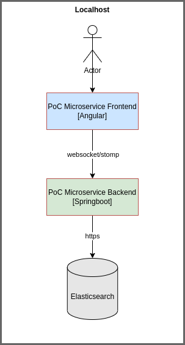

# Description

PoC Backend microservice to recover random datasets generated for Elasticsearch

# Configurations

Microservice configuration table

| Attribute                       			|      Description                        					     |  Default Value    |
|:-----------------------------------------:|:--------------------------------------------------------------:|:-----------------:|
| server.port                    		    | Default microservice listening port     						 | 8080              |
| spring.elasticsearch.username   			| Elasticsearch username basic credential 					     | elastic           |
| spring.elasticsearch.password   			| Elasticsearch password basic credential 					     | password          |
| spring.elasticsearch.host       			| Elasticsearch hostname                  						 | localhost         |
| spring.elasticsearch.port       			| Elasticsearch port          			  						 | 9200              |
| spring.elasticsearch.pathPrefix 			| Elasticsearch path prefix      		        				 | /                 |
| spring.elasticsearch.verifyHostnames      | Verify Elasticsearch certificates hostnames   				 | false	   	     |
| spring.elasticsearch.validateCertificates | Validate Elasticsearch certificate sign						 | false	         |
| spring.elasticsearch.caFile               | ca certificate name to validate Elasticsearch certificate sign |              	 |

# Local commands
Clear compile microservice

```
./mvnw clean install
```

Start microservice

```
./mvnw spring-boot:run
```

# docker build

compile the docker image for local environment

```
docker build -t uniovi-avib-morphingprojections-backend .
```

compile the docker image for avib environment

```
docker build --build-arg ARG_SPRING_PROFILES_ACTIVE=avib -t uniovi-avib-morphingprojections-backend:1.0.0 .
```

compile image and push to azure container registry

```
docker tag uniovi-avib-morphingprojections-backend:1.0.0 avibdocker.azurecr.io/uniovi-avib-morphingprojections-backend:1.0.0

docker push avibdocker.azurecr.io/uniovi-avib-morphingprojections-backend:1.0.0

```

# test docker

Local test of your image. Start a container like this:

```
docker run --name poc-uniovi-avib-data-projection-backend -p 8080:8080 -d poc-uniovi-avib-data-projection-backend
```

# Microservices architecture

